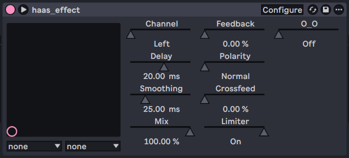

# haas_effect

a haas effect with extra steps

| parameter | description |
| --- | --- |
| channel | which channel to delay |
| delay | how many ms to delay the selected channel by |
| smoothing | how quickly the delay time transitions when changed. 0ms = instant (crunchy), 100ms = slow (pitchy) |
| polarity | inverts the wet signal |
| feedback | how much of the wet signal to feed back into the dsp chain |
| crossfeed | how much of the wet channel to feed into the dry channel |
| mix | self explanatory |
| limiter | clamps delay buffer input to [-1.0, 1.0] to prevent your speakers from blowing up |

## building

windows/linux: `cargo xtask bundle haas_effect --release`

macos: `cargo xtask bundle-universal haas_effect --release`
